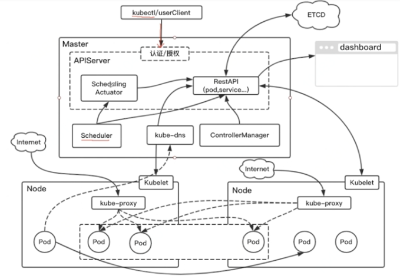
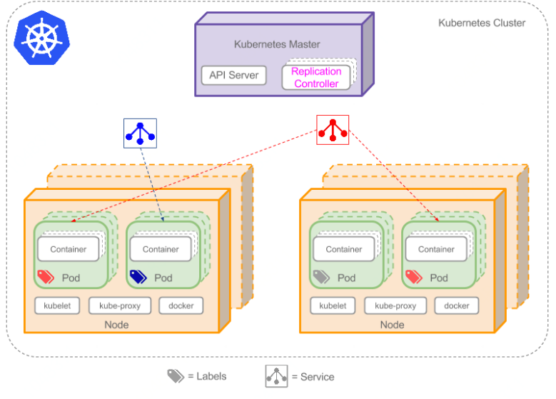
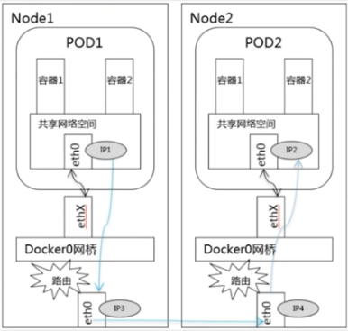
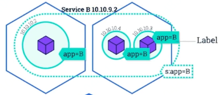

# Kuberbetes
Kuberbetes管理云平台多主机上容器化的应用
(https://kubernetes.io/)
## Kuberbetes基础架构

### 1. Master负责管理集群
> 主服务器协调集群中的所有活动，例如调度应用程序，维护应用程序的所需状态，扩展应用程序以及推出新更新。

- **APIServer:** APIServer负责对外提供RESTful的Kubernetes API服务，它是系统管理指令的统一入口，任何对资源进行增删改查的操作都要交给APIServer处理后再提交给etcd
 - 提供集群管理的REST API接口，包括认证授权（我们现在没有用到）数据校验以及集群状态变更等
 - 提供其他模块之间的数据交互和通信的枢纽（其他模块通过API Server查询或修改数据，只有API Server才直接操作etcd）
- **Schedule:** 负责调度pod到合适的Node上
 - kube-scheduler负责分配调度Pod到集群内的节点上，它监听kube-apiserver，查询还未分配Node的Pod，然后根据调度策略为这些Pod分配节点。kubernetes的各种调度策略就是它实现的。
- **controller manager:** 每个资源一般都对应有一个控制器，而controller manager就是负责管理这些控制器的。比如我们通过APIServer创建一个pod，当这个pod创建成功后，APIServer的任务就算完成了。而后面保证Pod的状态始终和我们预期的一样的重任就由controller manager去保证了。
 - Controller Manager由kube-controller-manager和cloud-controller-manager组成，是Kubernetes的大脑，它通过apiserver监控整个集群的状态，并确保集群处于预期的工作状态。 kube-controller-manager由一系列的控制器组成，像Replication Controller控制副本，Node Controller节点控制，Deployment Controller管理deployment等等 cloud-controller-manager在Kubernetes启用Cloud Provider的时候才需要，用来配合云服务提供商的控制
- **etcd:** etcd是一个高可用的键值存储系统，Kubernetes使用它来存储各个资源的状态，从而实现了Restful的API。

### 2.Node用作Kubernetes集群中的工作计算机
- **runtime:** 容器运行环境，目前Kubernetes支持docker和rkt两种容器
- **kube-proxy:** 该模块实现了Kubernetes中的服务发现和反向代理功能。反向代理方面：kube-proxy支持TCP和UDP连接转发，默认基于Round Robin算法将客户端流量转发到与service对应的一组后端pod。服务发现方面，kube-proxy使用etcd的watch机制，监控集群中service和endpoint对象数据的动态变化，并且维护一个service到endpoint的映射关系，从而保证了后端pod的IP变化不会对访问者造成影响。另外kube-proxy还支持session affinity。
- **kubelet:**Kubelet是Master在每个Node节点上面的agent，是Node节点上面最重要的模块，它负责维护和管理该Node上面的所有容器，但是如果容器不是通过Kubernetes创建的，它并不会管理。本质上，它负责使Pod得运行状态与期望的状态一致。
 - 每个工作节点上都运行一个kubelet服务进程，默认监听10250端口，接收并执行master发来的指令，管理Pod及Pod中的容器。每个kubelet进程会在API Server上注册节点自身信息，定期向master节点汇报节点的资源使用情况，并通过cAdvisor监控节点和容器的资源。

### 3.Pod
> Pod是Kubernetes的基本操作单元，也是应用运行的载体

#### Pod生命周期
> Pod被分配到一个Node上之后，就不会离开这个Node，直到被删除。当某个Pod失败，首先会被Kubernetes清理掉，之后ReplicationController将会在其它机器上（或本机）重建Pod，重建之后Pod的ID发生了变化，那将会是一个新的Pod。所以，Kubernetes中Pod的迁移，实际指的是在新Node上重建Pod。

#### Pod通讯

- **Pod内部通讯**
> 相同POD ip,通过localhost:port 进行访问

- **Pod间通讯（同Node）**
> 通过Docker网桥连接。可是使用POD ip访问。

- **Pod间通讯（不同Node）**

### 4.Lable
> Label是attach到Pod的一对键/值对，用来传递用户定义的属性。
>> 比如，你可能创建了一个"tier"和“app”标签，通过Label（**tier=frontend, app=myapp**）来标记前端Pod容器，使用Label（**tier=backend, app=myapp**）标记后台Pod。然后可以使用[Selectors]选择带有特定Label的Pod，并且将Service或者Replication Controller应用到上面。

### 5.1 Replication Controller
> 创建复制管理Pod

- **确保pod数量**
> 它会确保Kubernetes中有指定数量的Pod在运行。如果少于指定数量的pod，Replication Controller会创建新的，反之则会删除掉多余的以保证Pod数量不变。

- **确保pod健康**
> 当pod不健康，运行出错或者无法提供服务时，Replication Controller也会杀死不健康的pod，重新创建新的。

- **弹性伸缩**
> 在业务高峰或者低峰期的时候，可以通过Replication Controller动态的调整pod的数量来提高资源的利用率。同时，配置相应的监控功能（Hroizontal Pod Autoscaler），会定时自动从监控平台获取Replication Controller关联pod的整体资源使用情况，做到自动伸缩。

- **滚动升级**
> 滚动升级为一种平滑的升级方式，通过逐步替换的策略，保证整体系统的稳定，在初始化升级的时候就可以及时发现和解决问题，避免问题不断扩大

创建时Replication Controller时需指定：
- **Pod模版**：用来创建Pod副本模版。
- **Label**:Replication Controller需要监控Pod的标签。

### 5.2 Deployment
> 新一代的Replication Controller

- **Replication Controller全部功能**
- **事件和状态查看**
> 可以查看Deployment的升级详细进度和状态。
- **事件和状态查看**
> 可以查看Deployment的升级详细进度和状态。
- **回滚**
> 当升级pod镜像或者相关参数的时候发现问题，可以使用回滚操作回滚到上一个稳定的版本或者指定的版本。

- **版本记录**
> 每一次对Deployment的操作，都能保存下来，给予后续可能的回滚使用。

- **暂停和启动**
> 对于每一次升级，都能够随时暂停和启动。

- **多种升级方案** 
> Recreate：删除所有已存在的pod,重新创建新的; RollingUpdate：滚动升级，逐步替换的策略，同时滚动升级时，支持更多的附加参数，例如设置最大不可用pod数量，最小升级间隔时间等等。

### 6.Service
> [Service]是定义一系列Pod以及访问这些Pod的策略的一层**抽象**。  
因为Pods是短暂存在，ip不固定，所以需要靠带有固定ip的Server通过Label找到Pod组。  

>> 现在，假定有2个后台Pod，并且定义后台Service的名称为'backend-service'，lable选择器为（**tier=backend, app=myapp**）。_backend-service_ 的Service会完成如下两件重要的事情：
* 会为Service创建一个本地集群的DNS入口，因此前端Pod只需要DNS查找主机名为'backend-service'，就能够解析出前端应用程序可用的IP地址。
* 现在前端已经得到了后台服务的IP地址，但是它应该访问2个后台Pod的哪一个呢？Service在这2个后台Pod之间提供透明的**负载均衡**，会将请求分发给其中的任意一个。通过每个Node上运行的代理（kube-proxy）完成

## Kubernetes其他设计
### 1.Kubernetes设计理念
- API原则（声明API）
> 所有pod、service是名词指定。即数量增减不通过加减，而是直接指定数量。

- 控制机设计原则
> 预知错误，容错处理，自动恢复，降级处理

### 2.Kubernetes网络
- CNI
- FLannel、Calico、Weave
- Pod网络

 学习参考：http://www.dockone.io/article/932
